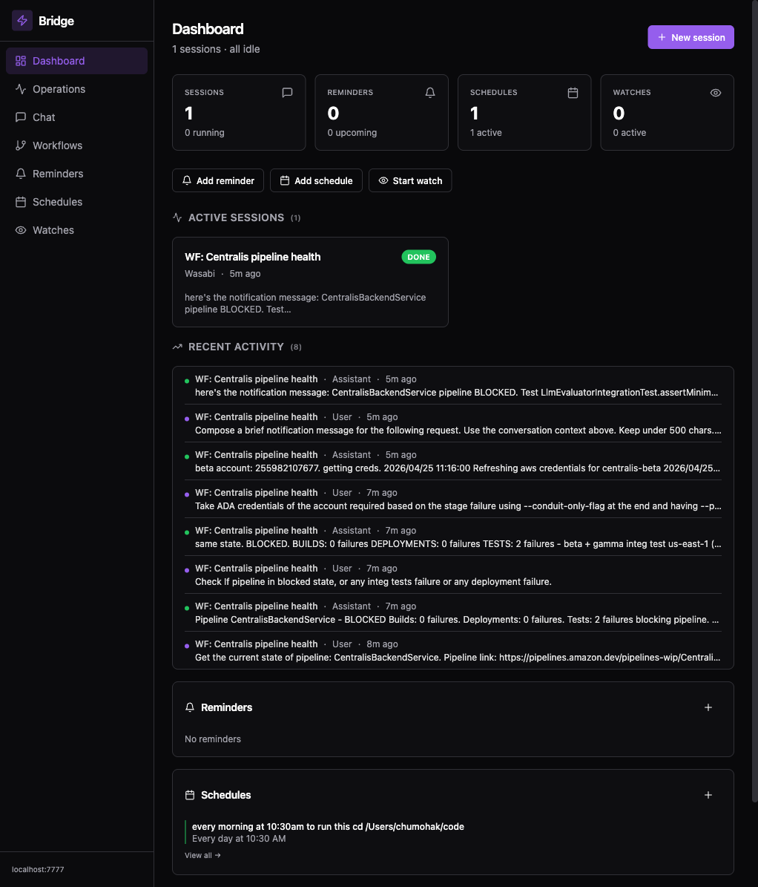
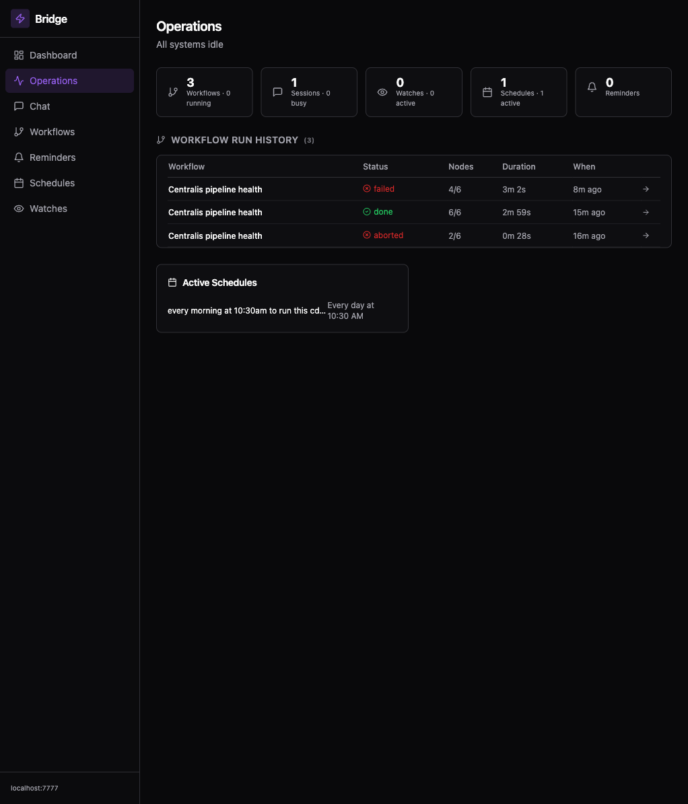
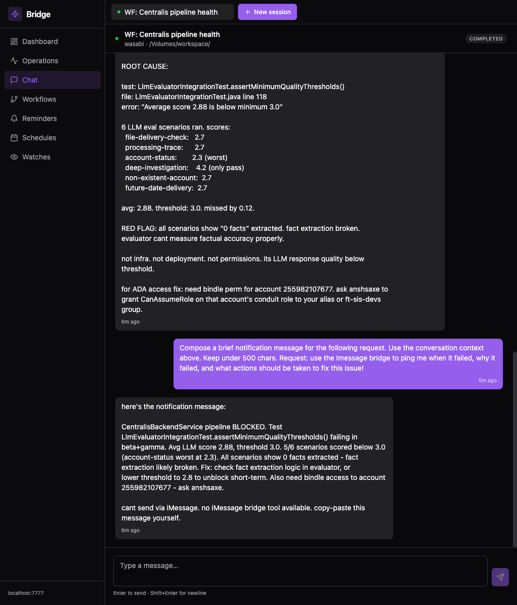
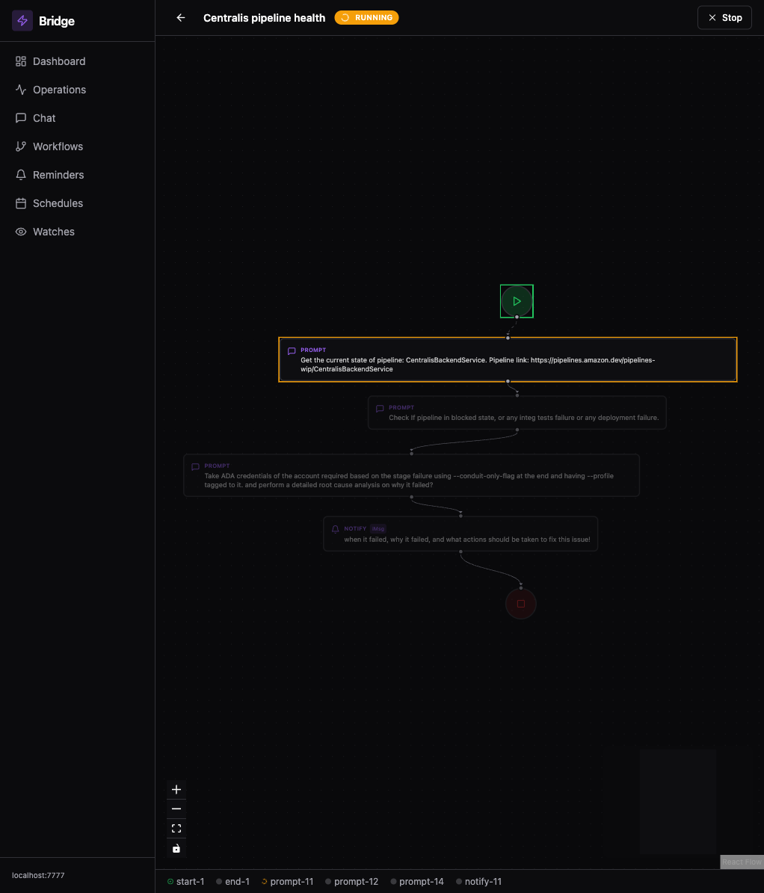
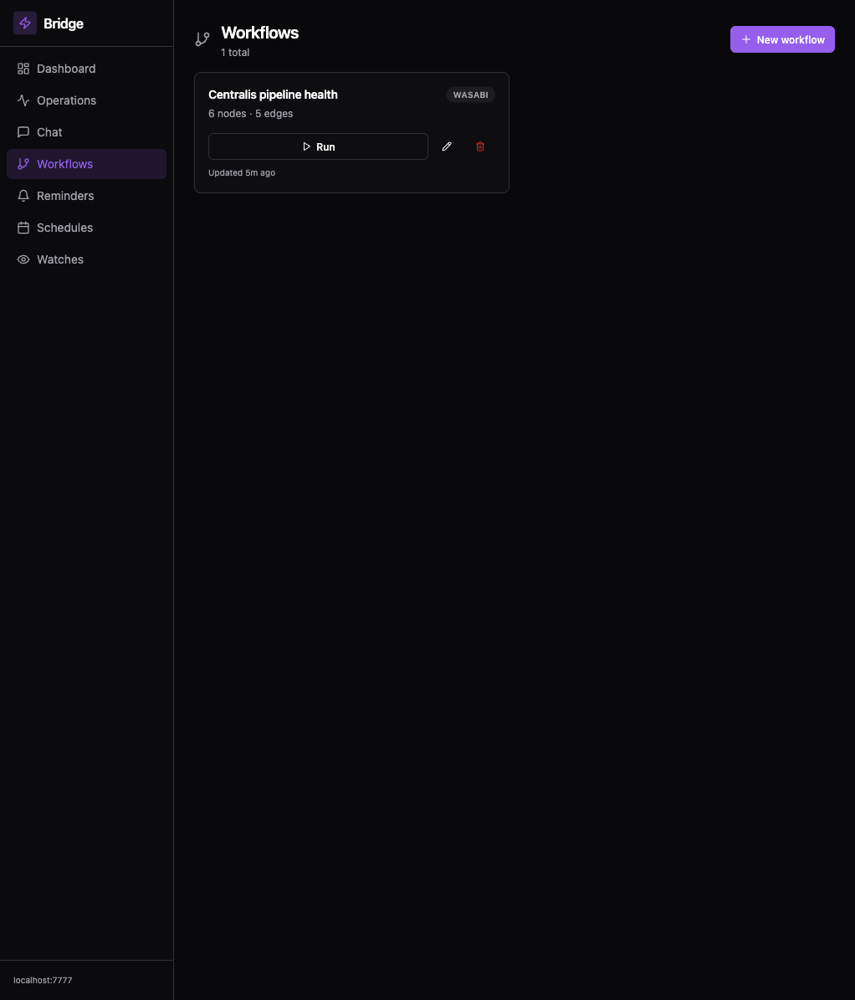
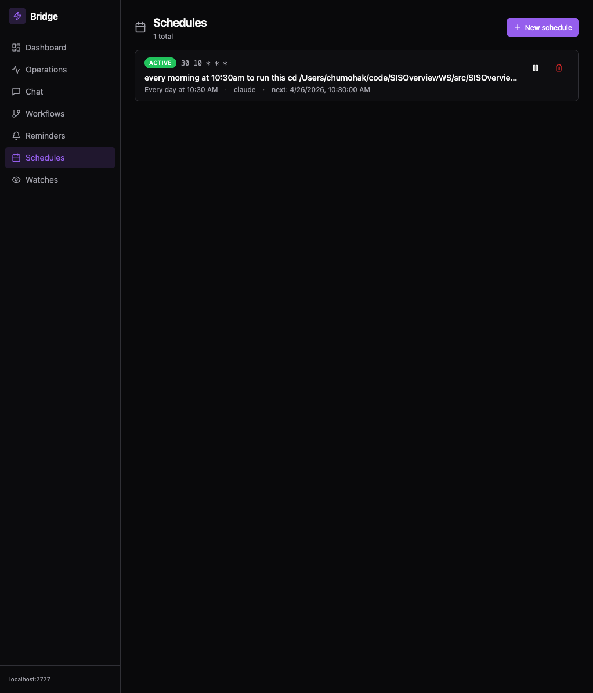

# Bridge — Control AI from Anywhere

Chat with Claude Code, Wasabi, and Kiro CLI from your **phone, Slack, or a beautiful web dashboard**. Build visual workflows, schedule automations, monitor pipelines — all with real-time updates across every channel.

## Screenshots

### Dashboard — Stats, sessions, activity feed, quick actions


### Operations — Airflow-style unified view of everything running


### Chat — Multi-session tabs, tool picker, live responses


### Workflow Editor — Drag-and-drop DAG builder with 8 node types


### Workflow List — Run, edit, delete, schedule workflows


### Schedules — Cron-based automation with pause/resume


---

## What is this?

A multi-channel daemon that lets you drive AI CLIs from any device:

- **Web dashboard** (localhost:7777) — React + TailwindCSS admin panel with chat, workflows, automation
- **iMessage** — self-chat from your iPhone, Apple Watch, or any Apple device
- **Slack DM** — DM your bot from anywhere (laptop, dev desktop, phone)

All channels route through the same daemon with shared session state, parallel execution, and cumulative memory across conversations.

## Architecture

```
┌─────────┐  ┌────────┐  ┌────────────┐
│ iPhone  │  │ Slack  │  │ Web (:7777)│
└────┬────┘  └───┬────┘  └──────┬─────┘
     │          │              │
     ▼          ▼              ▼
┌────────────────────────────────────────┐
│   Python Daemon (macOS / Linux)        │
│                                         │
│   SessionManager (parallel, per-sess)  │
│   WorkflowEngine (DAG executor)        │
│   EventBus (pub/sub for live updates)  │
│   FastAPI Gateway (REST + WebSocket)   │
│                                         │
│   Channels: iMessage poll · Slack WS   │
│   Adapters: Claude · Wasabi · Kiro     │
└────────────────────────────────────────┘
```

## Features

### Web Dashboard
- **Multi-session tabs** — run multiple conversations in parallel, switch instantly
- **Stats overview** — sessions, reminders, schedules, watches with live counts
- **Activity feed** — last 15 messages across all sessions, role-coded
- **Quick actions** — add reminder / schedule / watch inline from dashboard
- **Dark theme** — polished shadcn-style UI, 141KB gzipped bundle

### Operations Dashboard (Airflow-style)
- **Running Now** — cards with progress bars (% nodes done), click to open runner
- **Run history table** — all workflow runs with status, nodes, duration, timestamp
- **Scheduled workflows** — upcoming cron triggers
- **Active watches + schedules** — unified view of all autonomous operations

### Visual Workflow Creator
- **Drag-and-drop canvas** — React Flow with zoom, pan, minimap, dark theme
- **8 node types** — Start, Prompt, Branch (conditional/parallel), Merge, Delay, Approval, Notify, End
- **Single-session context** — all nodes share conversation history, LLM remembers prior outputs
- **Branch nodes** — conditional (LLM evaluates yes/no) or parallel (fan-out + merge barrier)
- **Approval gates** — workflow pauses, shows Continue/Abort buttons, waits for human
- **Notify nodes** — LLM composes message from conversation context, sends to iMessage/Slack/Both
- **Animated runner** — nodes pulse amber (running), turn green (done), red (failed)
- **Click-to-inspect** — click any node to see its output in side panel
- **Run persistence** — survives reboots, orphaned runs auto-marked failed

### Slack Integration
- **Socket Mode** — no public URL needed, outbound WebSocket
- **Bare commands** — `status`, `help`, `tool wasabi` (no slash prefix)
- **Thread-aware** — replies stay in message thread
- **Emoji reactions** — ⚡ on acknowledgment

### Multi-Tool Support
- **Claude Code** — persistent sessions, `--resume`, `--effort max`
- **Wasabi** — conversational memory via prompt history injection
- **Kiro CLI** — session management, custom agent support
- Switch instantly: `tool claude` / `tool wasabi` / `tool kiro`

### Parallel Execution
- Up to 4 concurrent sessions (configurable)
- Per-session lock prevents double-execution
- Global semaphore prevents CPU saturation

### Watch Mode
- Monitor pipelines, tickets, alarms for state changes
- Natural language: `watch all my pipelines`
- Auto-diagnose + suggest fix on alert
- 30min cooldown prevents spam

### Scheduled Tasks
- Natural language: `schedule every morning check pipeline status`
- LLM parses → you confirm → runs on cron
- Pause, resume, delete via UI or commands

### Smart Reminders
- Natural language: `remind tomorrow 9am check deploy`
- Relative time: `remind 5m check build`
- Create via UI or text commands

### Progress Tracking (Claude Code)
- `eta` — elapsed time, current action, ETA
- Auto-progress updates, stuck detection, self-diagnosis

### Full CRUD Admin
- Create/edit/delete/pause/resume for all automation types
- Natural-language LLM parse → preview → confirm workflow
- Works from dashboard, iMessage, or Slack

### Persistent Memory (claude-mem)
- Cross-session memory via claude-mem plugin
- Hooks fire in `claude -p` mode
- 116 sessions backfilled from history
- Context auto-injected into new sessions

## Requirements

- macOS 13+ **OR** Linux (Amazon Linux / Ubuntu)
- Python 3.10+
- Node.js 18+ (for dashboard build, optional)
- Claude Code CLI installed and authenticated
- **macOS only:** iMessage signed in, Full Disk Access
- **Linux:** Slack-only mode (iMessage gracefully disabled)

## Quick Setup

### 1. Clone

```bash
git clone https://github.com/MohakChugh/imessage-claude-bridge.git ~/bridge
cd ~/bridge
```

### 2. Install dependencies

```bash
pip3 install --break-system-packages mcp pytest slack-bolt slack-sdk fastapi uvicorn
```

### 3. Configure

```bash
cp config.example.json config.json
# Edit: set directories, slack tokens (optional), cli_tool
```

### 4. Build the dashboard (optional)

```bash
cd web && npm install && npm run build && cd ..
```

### 5. Run

```bash
python3 daemon.py                    # Foreground
python3 install.py                   # macOS launchd (auto-start)
```

### 6. Open dashboard

http://localhost:7777

## Commands

All commands work via iMessage (`/cmd`), Slack (`cmd`), or the web dashboard.

| Command | Description |
|---------|-------------|
| `status` | What's happening now |
| `end` | End session, clear context |
| `cancel` | Kill running task |
| `history` | Last 5 messages |
| `switch <dir>` | Switch directory |
| `tool <name>` | Switch tool (claude/wasabi/kiro) |
| `eta` | Progress + ETA |
| `watch <text>` | Create watch |
| `schedule <text>` | Create recurring task |
| `remind <text>` | Set reminder |
| `queue <prompt>` | Run after current task |

Start session: `new:<dir>: <prompt>` (e.g. `new:centralis: check pipelines`)

## Architecture

```
~/bridge/
├── daemon.py              # Main daemon — channels, routing, commands
├── session_manager.py     # Parallel multi-session state
├── workflow_engine.py     # DAG executor with 8 node types
├── workflow_store.py      # Workflow JSON persistence
├── event_bus.py           # Pub/sub for live UI updates
├── gateway.py             # FastAPI REST + WebSocket (port 7777)
├── slack_channel.py       # Slack Socket Mode listener
├── watcher.py             # Watch mode — pipeline/ticket monitoring
├── scheduler.py           # Cron scheduler
├── progress_tracker.py    # ETA + stuck detection
├── parser.py              # Message prefix parsing
├── chatdb.py              # iMessage chat.db reader (macOS)
├── sender.py              # iMessage via AppleScript (macOS)
├── echo_filter.py         # Echo loop prevention
├── config.py              # Config + state management
├── adapters/
│   ├── claude_adapter.py  # Claude Code
│   ├── wasabi_adapter.py  # Wasabi (history injection)
│   └── kiro_adapter.py    # Kiro CLI
├── web/                   # React dashboard
│   └── src/
│       ├── components/
│       │   ├── Dashboard.tsx          # Stats + activity
│       │   ├── OperationsDashboard.tsx # Airflow-style view
│       │   ├── ChatView.tsx           # Session tabs + chat
│       │   ├── WorkflowEditor.tsx     # React Flow canvas
│       │   ├── WorkflowRunner.tsx     # Animated execution
│       │   ├── WorkflowList.tsx       # Workflow management
│       │   ├── CreateDialog.tsx       # CRUD dialogs
│       │   └── workflow-nodes/        # 8 custom node types
│       ├── api/                       # REST + WebSocket client
│       └── stores/                    # Zustand state
├── config.json            # User configuration
├── state.json             # Runtime state
├── workflows.json         # Workflow definitions
├── workflow_runs.json     # Run history (survives reboots)
└── tests/                 # 256 tests
```

## Robustness

- **Auto-start at login** — launchd `RunAtLoad=true` + `KeepAlive=true`
- **Auto-restart on crash** — KeepAlive respawns daemon
- **Atomic file writes** — all state files write to `.tmp` then `os.replace()`
- **Orphan recovery** — workflow runs interrupted by crash auto-marked as failed
- **Run history capped** — 200 entries max, prevents unbounded growth
- **Concurrent-safe** — per-session locks + global semaphore
- **Zero manual steps after reboot** (assuming AWS credentials are fresh)

## Dev Desktop Setup (Linux)

```bash
git clone https://github.com/MohakChugh/imessage-claude-bridge.git ~/bridge
cd ~/bridge
pip3 install slack-bolt slack-sdk fastapi uvicorn
cp config.example.json config.json  # Edit: Slack tokens, directories
python3 daemon.py
# SSH tunnel for remote: ssh -L 7777:localhost:7777 your-server
```

## Tests

```bash
python3 -m pytest tests/ -v
```

256 tests covering daemon commands, routing, adapters, config, echo filter, progress, scheduler, watcher, integration.

## License

MIT
